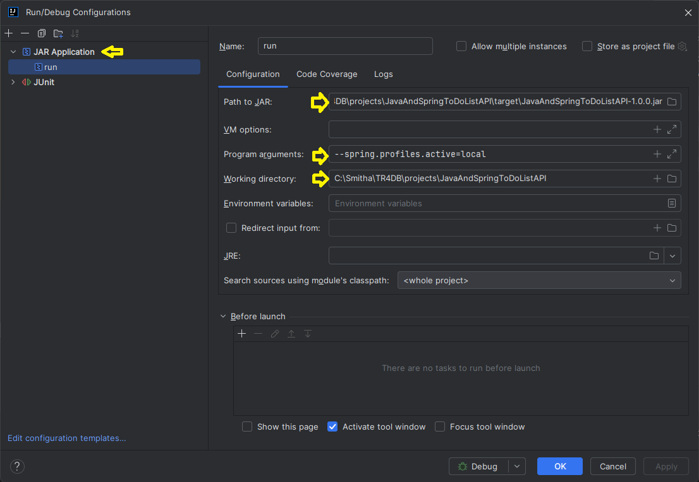

_How to run locally_

Create a .env.properties file in the resources folder, with the db credentials
DB_USER=dbusername
DB_PASS=password

Open a terminal and cd into project directory

- `mvn clean package`
- java -jar  .\target\JavaAndSpringToDoListAPI-1.0.0.jar --spring.profiles.active=local`

_How to run via Docker_

Open a terminal and cd into project directory

- `mvn clean package`
- `docker-compose up --build`

_PS : While running from within the Docker container, Spring reads the DB connection and user details from the environment variable set in the `docker-compose.yml`_ 

_How to debug in Intellij community edition_

